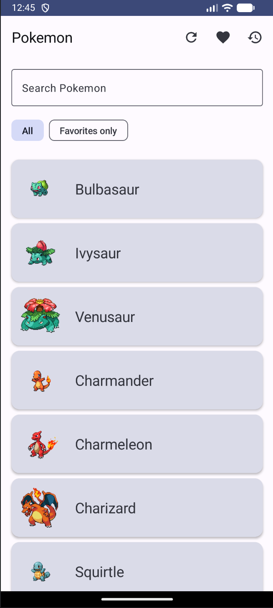
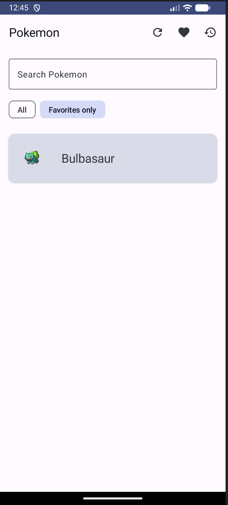
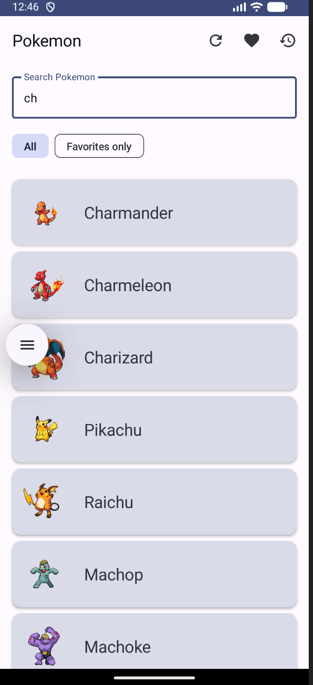
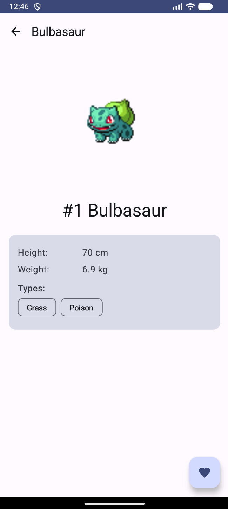

ФИО: Пелих Дмитрий Александрович
Группа: Б9123-09.03.03

Выбранный API:
PokeAPI (https://pokeapi.co/). Тот же проект, что в ДЗ №4–5 — список покемонов, детали, избранное и история через Room, DI через Hilt.

Что сделано в ДЗ №6:

+ Экран списка переписан на реактивную Flow-композицию — состояние больше не пишется через _state.value = ..., а собирается как combine четырёх независимых источников.
+ Источники: searchQuery (StateFlow), viewMode All / Favorites only (StateFlow), refreshTrigger (SharedFlow, replay=0), repository.favorites (Flow из Room).
+ Цепочка операторов: combine + flatMapLatest + debounce(300) + distinctUntilChanged + catch + stateIn(WhileSubscribed).
+ Поиск, фильтр и удаление из избранного автоматически перерисовывают список без ручной перезагрузки. flatMapLatest отменяет старый запрос при новом значении.

Чеклист требований ТЗ:

+ Flow / StateFlow / SharedFlow с разделением ролей: StateFlow для длительного состояния (searchQuery, viewMode, listUiState, favorites), SharedFlow для потока событий (refreshTrigger).
+ Минимум 3 независимых источника — у меня 4 (searchQuery + viewMode + refreshTrigger + repository.favorites), хотя бы один из data layer (favorites из Room).
+ Оператор объединения combine (используется дважды).
+ Операторы преобразования / управления: flatMapLatest, debounce, distinctUntilChanged, onStart, map, catch.
+ Реальная композиция, не формальная — каждый источник реально влияет на UI.
+ listUiState не пишется через MutableStateFlow + copy — построен как cold→hot Flow через stateIn.
+ Базовый проект из ДЗ №4 остаётся рабочим.

Стек:

Kotlin 1.9.20, Compose Material3, Navigation Compose 2.7.6, Hilt 2.50, Room 2.6.1, Retrofit 2.9.0, Coil 2.5.0, Coroutines + Flow / StateFlow / SharedFlow.

Скриншоты:

Главный экран — чипы All / Favorites only под поиском, кнопка Refresh в TopBar:

«Favorites only» выбран — список перерисовался только избранными (реактивная композиция):

Поиск с debounce — введено «ch», отфильтрованы покемоны с этой подстрокой:

Detail с favorite (сердечко закрашено):

